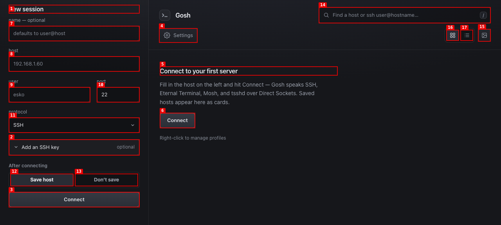
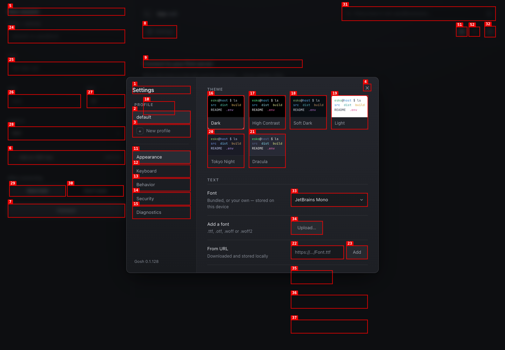
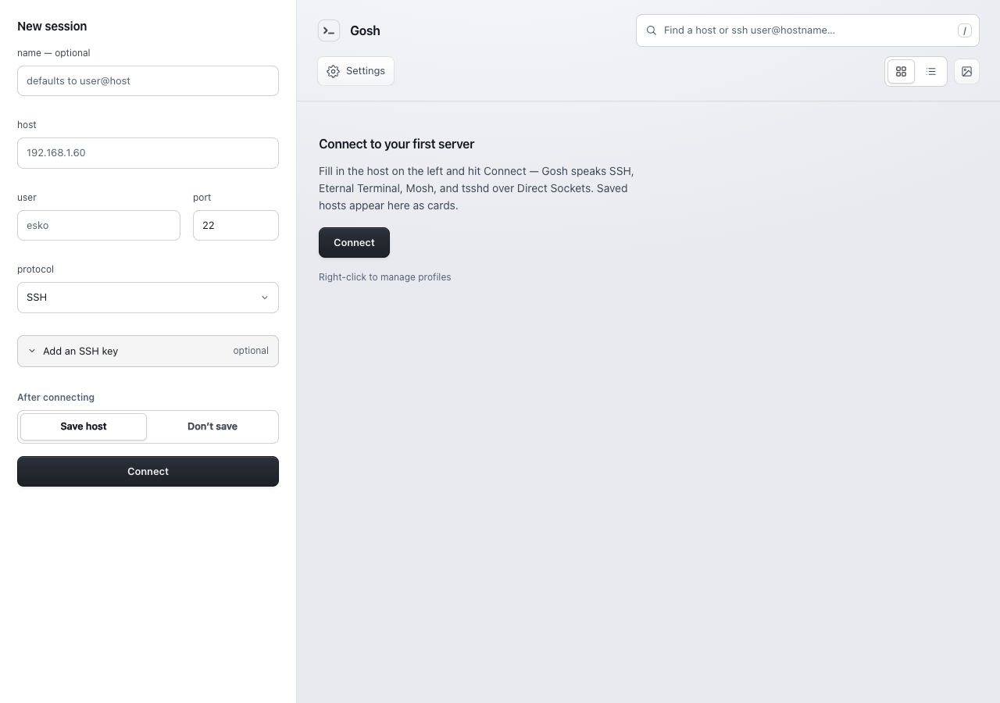

# Gosh

**Gosh** is a ChromeOS [Isolated Web App](https://developer.chrome.com/docs/iwa/introduction) terminal client for **SSH**, **Mosh**, **Eternal Terminal**, and **tsshd**. It connects over Chrome’s Direct Sockets API — no browser WebSocket proxy and no companion daemon on the Chromebook.



## Features

- **SSH, Mosh, Eternal Terminal, and tsshd** over Direct Sockets (TCP / UDP)
- **Saved hosts and profiles** with keys, startup commands, and per-host settings
- **Restty terminal** with native pane splits, scrollback, themes, and font controls
- **Custom caption tabs** in an unframed ChromeOS window (ChromeOS Terminal–inspired)
- **QUIC or KCP** for tsshd UDP mode
- **Image paste** to the remote host (Kitty graphics–friendly path)
- **Optional credential vault** for saved passwords (device-locked)
- **Light / dark / system** chrome and terminal themes





## Requirements

- **ChromeOS or Chrome 120+** (Chromebook recommended for the full windowing experience)
- Flags below enabled (restart Chrome after changing them)
- A reachable SSH (and optionally Mosh / ET / tsshd) host

## Install

### 1. Enable Chrome flags

Open `chrome://flags` and set these to **Enabled**, then restart Chrome:

| Flag | Why |
|------|-----|
| `#enable-isolated-web-apps` | IWA runtime |
| `#enable-isolated-web-app-dev-mode` | Required today to install from an update manifest outside enterprise policy |
| `#enable-chromeos-isolated-web-app-set-shape` | Rounded unframed window corners |
| `#enable-desktop-pwas-additional-windowing-controls` | Minimize / maximize in the custom caption |

If Direct Sockets still appear unavailable after install, also enable `#enable-direct-sockets-for-isolated-web-apps` and restart again.

### 2. Install from the update manifest

1. Open `chrome://web-app-internals`
2. Find **Install IWA from Update Manifest**
3. Paste:

   ```text
   https://esko.github.io/gosh/update.json
   ```

4. Launch **Gosh** from the app launcher (not a normal browser tab)

Landing page with the same URL: [esko.github.io/gosh](https://esko.github.io/gosh/).

### 3. Updates

Installed copies check the update manifest periodically. You can also use **Force update check** on `chrome://web-app-internals` after a new GitHub Release is published.

## Quick start after install

1. Open Gosh from the launcher
2. Add a host (user, hostname, protocol) or pick a recent connection
3. Accept the host key prompt on first connect
4. Authenticate with key and/or password when prompted

## Development

Contributors: see [docs/DEVELOPMENT.md](docs/DEVELOPMENT.md) for setup, architecture, and verification.

Local Chromebook install (Dev Mode Proxy or a local `.swbn`): [docs/IWA_DEV_SETUP.md](docs/IWA_DEV_SETUP.md).

Publishing a release to GitHub Pages: [docs/RELEASE.md](docs/RELEASE.md).

```bash
npm install
npm run dev          # http://127.0.0.1:5173 — use with Dev Mode Proxy
npm run typecheck
npm run test
npm run build
```

## References

### Terminal renderer

| Project | Role |
|---------|------|
| [Restty](https://github.com/wiedymi/restty) ([`@eslzzyl/restty`](https://www.npmjs.com/package/@eslzzyl/restty)) | Browser terminal UI — panes, splits, WebGPU/WebGL2; vendored under `vendor/restty/` |
| [Ghostty](https://github.com/ghostty-org/ghostty) (`libghostty-vt`) | WASM VT / terminal core used inside Restty |

### SSH / transport WASM and clients

| Project | Role |
|---------|------|
| [Chromium libapps](https://chromium.googlesource.com/apps/libapps) — [nassh](https://chromium.googlesource.com/apps/libapps/+/HEAD/nassh/), [wassh](https://chromium.googlesource.com/apps/libapps/+/HEAD/wassh/), [wasi-js-bindings](https://chromium.googlesource.com/apps/libapps/+/HEAD/wasi-js-bindings/), [ssh_client](https://chromium.googlesource.com/apps/libapps/+/HEAD/ssh_client/) | Upstream client stack; assets copied into `app/upstream/` |
| OpenSSH WASM (`ssh.wasm`, plus `scp.wasm` / `sftp.wasm` / `ssh-keygen.wasm`) | SSH client (and helpers) run via wassh; from nassh’s plugin build |
| [Mosh](https://mosh.org/) ([mobile-shell/mosh](https://github.com/mobile-shell/mosh)) — `mosh-client.wasm` | Predictive remote shell; WASM client shipped with the nassh plugin (`app/upstream/plugin/wasm/mosh-client.wasm`) |
| [wassh](https://chromium.googlesource.com/apps/libapps/+/HEAD/wassh/) | WASI / WASM host that runs the OpenSSH and Mosh plugins in the browser |
| [Eternal Terminal](https://eternalterminal.dev/) ([MisterTea/EternalTerminal](https://github.com/MisterTea/EternalTerminal)) | Persistent TCP sessions; TypeScript Direct Sockets client in `app/src/et/` (protobuf schemas from upstream, not a WASM plugin) |
| [tsshd](https://github.com/trzsz/tsshd) | UDP SSH relay (KCP/QUIC); browser client compiled to WASM under `app/src/tsshd/runtime/` |

### Product / platform

| Project | Role |
|---------|------|
| [Google Terminal](https://chromium.googlesource.com/apps/libapps/+/HEAD/terminal/) | ChromeOS Terminal UX reference |
| [Isolated Web Apps](https://developer.chrome.com/docs/iwa/introduction) | Packaging and install model |
| [Direct Sockets](https://developer.chrome.com/docs/iwa/direct-sockets) | TCP/UDP from the IWA |

## License

Upstream libapps assets are Chromium-licensed. Restty is MIT. tsshd retains its upstream license. Preserve notices for copied runtime and plugin files.
