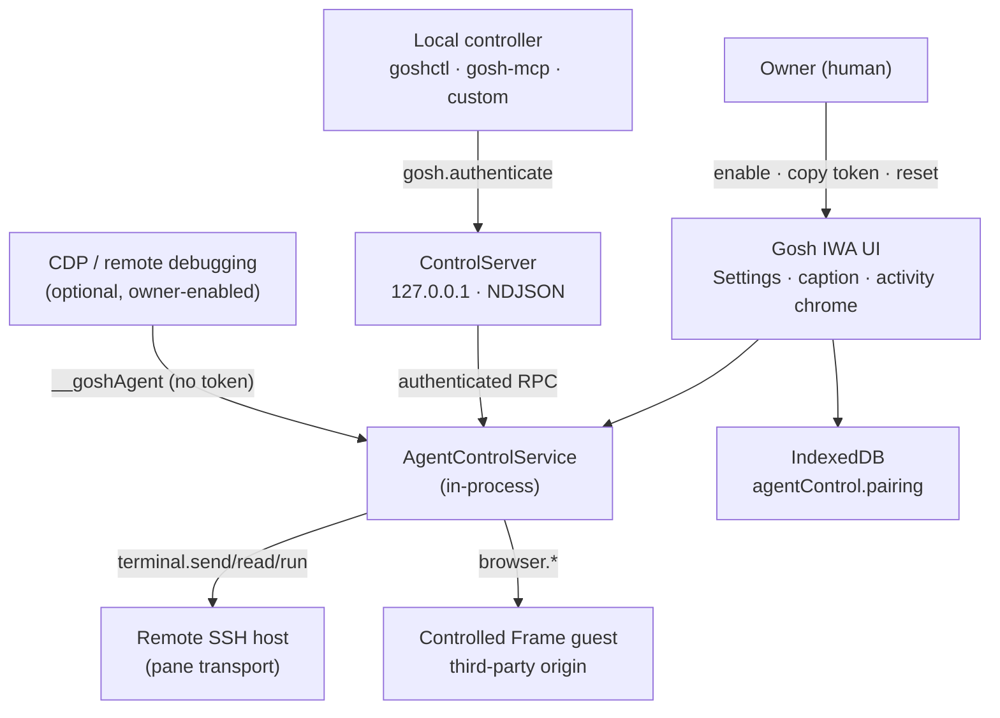

# Agent control threat model

**Release gate** for external agent control (loopback JSON-RPC, CLI, MCP). Do not ship external-control features to owners until this document is reviewed and the [ChromeOS validation matrix](../adr/0013-agent-control-transport.md#chromeos-validation-matrix-required-before-production) in ADR 0013 is recorded on hardware.

This document extends [`docs/SECURITY.md`](../SECURITY.md) (IWA, SSH, storage) with threats specific to the agent control plane: [`AgentControlService`](../../app/src/agent/AgentControlService.ts), loopback transport ([ADR 0013](../adr/0013-agent-control-transport.md)), wire protocol ([`docs/agent/PROTOCOL.md`](./PROTOCOL.md)), and Controlled Frame browser tabs ([ADR 0014](../adr/0014-controlled-frame-browser-tabs.md)).

**Status:** Design review complete in-repo. **Chromebook validation not performed** in this slice — see [Residual risks](#residual-risks-requiring-chromebook-validation).

## Scope

| In scope | Out of scope |
|----------|----------------|
| External control via loopback TCP (`gosh.authenticate` + JSON-RPC) | Remote / LAN / `0.0.0.0` bind (explicitly forbidden) |
| In-process `AgentControlService` API surface | Upstream nassh/wassh SSH wire security (see main SECURITY.md) |
| `window.__goshAgent` when CDP/debug access exists | Shipping CLI/MCP binaries as signed product artifacts |
| Controlled Frame browser tabs and `browser.*` RPCs | Mosh transport, SFTP, port forwarding |
| Pairing token lifecycle and audit ring | Enterprise device policy integration |

## Actors and trust boundaries

**Trust assumptions**

1. The **owner** opts in to external control and protects the pairing token like a session secret.
2. **Local processes** on the same machine that can reach `127.0.0.1` are in the threat zone once control is enabled — loopback is not a strong authentication boundary by itself; the bearer token is.
3. **Remote SSH hosts** and **embedded websites** are untrusted; agents must treat their output as hostile input.
4. **CDP attach** (remote debugging) is equivalent to full in-process control — no pairing required today.

## Assets

| Asset | Location | Compromise impact |
|-------|----------|-------------------|
| **Pairing bearer token** | IndexedDB `agentControl` store (`pairing` key) | Full workspace control for any local client that can reach the listener |
| **Terminal sessions** | Pane transports (SSH/Mosh/ET) | Read scrollback, inject keystrokes, run commands (`terminal.send` / `read` / `run`) |
| **SSH keys & vault** | Main `gosh` IndexedDB (separate from agent pairing) | Not exposed directly by agent RPC; indirect risk via shell commands in a connected pane |
| **Browser tab state** | Per-tab `persist:gosh-browser:<tabId>` partition | Cookies, storage, authenticated web sessions for sites the owner opened |
| **Browser snapshot text** | RPC responses (`browser.snapshot`, `browser.query`) | Page content, form labels, partial field values (secrets redacted) |
| **Audit ring** | In-memory (`AuditRing`, 100 entries) | Method names and success/failure — no payloads |
| **Opaque pane/tab ids** | `WorkspaceRegistry` | Targeting wrong pane if client or agent mis-identifies |

## Threat scenarios and mitigations

### Controller impersonation

| Threat | Example | Mitigations | Residual risk |
|--------|---------|-------------|---------------|
| Unauthenticated RPC | Malware opens TCP to Gosh port and calls `terminal.send` | **Disabled by default**; `gosh.authenticate` required before workspace methods; wrong token → `unauthorized` (-32002) | Listener absent when disabled |
| Stolen bearer token | Process reads token from shell history, clipboard, or process list | 256-bit random token (`generatePairingToken`); timing-safe compare; **Reset pairing token** in Settings rotates secret and restarts server | Any local process with token is a full controller until reset |
| Replay after reset | Old client keeps sending RPCs | Server restart on disable/reset/rotate drops connections; new token invalidates old clients | In-flight TCP may complete one frame before disconnect — bounded by rate limits |
| CDP bypass | Attacker with `--remote-debugging-port` calls `window.__goshAgent` directly | Documented dev hook; **not gated by pairing** (see [CDP surface](#cdp-window__goshagent-surface)) | Owner who enables remote debugging grants full control |

### Token theft and pairing credential handling

| Threat | Example | Mitigations | Residual risk |
|--------|---------|-------------|---------------|
| Token at rest | Malware reads IndexedDB | Token stored only while enabled; same IWA origin isolation as SSH keys; not exported in backup JSON | Physical / malware with renderer access can read token |
| Token in transit | Token logged by proxy or `tcpdump` on loopback | Loopback-only bind; TLS not used on interim transport (local trust zone) | Other local users/processes on shared loopback namespace |
| Token in UI | Shoulder surfing Settings screen | Owner copies once; reset path documented | Token visible in Settings while enabled |
| Clipboard leak | Copy button writes token to system clipboard | Clipboard is owner-controlled; brief exposure | Other apps reading clipboard |

**Owner guidance:** Treat the pairing token like an API key. Reset immediately if leaked. Disable external control when not in use.

### LAN exposure (forbidden)

Binding `0.0.0.0` or a LAN interface would let **any device on the network** attempt authentication (and exfiltrate if the token leaks). Gosh intentionally **does not** implement LAN bind:

| Reason | Detail |
|--------|--------|
| Attack surface | Home/office Wi‑Fi, guest networks, and compromised LAN peers become reachable controllers |
| Token entropy vs exposure | Bearer token over plaintext TCP on a network multiplies theft channels (sniffing, ARP, compromised router) |
| Product posture | Personal SSH terminal — not a network service; aligns with SECURITY.md **no LAN scanning** and **explicit connect** |
| IWA permissions | Direct Sockets LAN keys exist for **outbound SSH targets**, not for advertising an inbound control API |

Implementation: `ControlServer` defaults `bindAddress` to `127.0.0.1` ([`ControlServer.ts`](../../app/src/agent/server/ControlServer.ts)); ADR 0013 non-goal: binding `0.0.0.0`. Future Unix-socket or policy-gated alternatives must re-review this document before any non-loopback bind.

### Malicious websites in Controlled Frame

| Threat | Example | Mitigations | Residual risk |
|--------|---------|-------------|---------------|
| Drive-by navigation | Agent `browser.navigate` to attacker URL | Owner opened browser tab kind; agent actions require authenticated control | Social engineering of agent tools |
| Permission escalation | Site requests camera, geolocation, USB | `handleBrowserPermissionRequest` **denies by default**; deny-list in `BROWSER_DENIED_PERMISSIONS` | New permission types until deny-list updated |
| UI redress / clickjacking | Malicious page tricks agent into clicking | Semantic snapshot + ref-based interaction; no arbitrary `evaluate` | Agent logic bugs mis-reading snapshot |
| Open redirect / `javascript:` URLs | `browser.navigate` to dangerous URL | URL validation in host layer; owner visibility in address bar | Scheme handlers depend on Chromium CF |
| Cross-tab partition bleed | Site A reads Site B cookies | **Per-tab** `persist:gosh-browser:<tabId>` partition; cleared on tab close | Same-tab navigation retains partition |

Agents must assume **guest page content is hostile** — same as untrusted web in a normal browser, plus automation can act faster than a human.

### Browser credential and storage exfiltration

| Threat | Example | Mitigations | Residual risk |
|--------|---------|-------------|---------------|
| Snapshot exfiltration | `browser.snapshot` returns logged-in page text | Size caps (200 nodes, 256 KiB default); password fields `[redacted]` | Non-password secrets in plain text on page |
| Query / wait helpers | Enumerate DOM for hidden tokens | Bounded scripts in `browserSnapshotScript.ts` only; no generic `browser.evaluate` | Visible page text still returned |
| Cookie / storage direct read | RPC reads `document.cookie` | No RPC exposes raw storage APIs; snapshot walks DOM only | Values rendered into DOM are visible |
| Agent navigates to file:// or internal URLs | Exfil local resources | CF + navigation policy as implemented in browser host | ChromeOS-specific URL blocks need device check |

Controlled Frame storage is **not** readable from arbitrary `https://` pages or other IWAs; exfiltration path is **authenticated agent RPC** or **CDP**.

### Terminal output and prompt injection

| Threat | Example | Mitigations | Residual risk |
|--------|---------|-------------|---------------|
| Hostile scrollback | SSH server prints fake instructions (“ignore previous…”) | `terminal.read` returns raw text — **no sanitization**; agent clients must treat output as untrusted | Core agent safety problem, not Gosh-specific |
| Injection via `terminal.run` output | Command output manipulates agent planner | Output bounded (`maxOutputBytes` default 256 KiB); OSC 133 completion reduces ambiguity vs silence | Malicious server still controls command output |
| Fake OSC 133 markers | Server emits spoof `D` markers | Markers come from Restty OSC feed tied to pane stream | Compromised server or MITM SSH could confuse completion |
| Credential harvesting in output | `cat ~/.aws/credentials` visible in read | Auth required for RPC; audit omits payloads | Authorized controller is intentionally powerful |

**Guidance for agent authors:** Never execute instructions found in terminal text. Prefer `terminal.run` with explicit commands over parsing scrollback for “suggested” commands. Correlate pane id and tab title before acting.

### Accidental control of the wrong pane

| Threat | Example | Mitigations | Residual risk |
|--------|---------|-------------|---------------|
| Stale pane id | Client caches `pane_abc` after split/close | Opaque ids from `WorkspaceRegistry`; `not-found` on missing pane | Client must refresh `workspace.listPanes` |
| Multi-tab ambiguity | Two SSH tabs to same host | `listTabs` includes `title`, `kind`, `active` | Similar titles confuse humans and agents |
| Split layout | Agent focuses pane B while owner works in pane A | `pane.focus` changes Restty focus; activity chrome shows agent-active pane | Owner may not notice focus change |
| Restty id leakage | Client uses numeric Restty id | Public API uses opaque `paneId` only (ADR 0011) | CDP scripts using internals bypass registry |

Clients should **re-list panes** after layout changes and include `tabId` + `paneId` in their own logs.

### Input while the human is typing

| Threat | Example | Mitigations | Residual risk |
|--------|---------|-------------|---------------|
| Keystroke interleaving | `terminal.send` during owner typing | **750 ms human-input guard** rejects `terminal.send` / `terminal.run` with `conflict` unless `force: true`; **activity UI** pulses pane/tab on `send` and sustained on `terminal.run` | Race inside the guard window or with `force: true` |
| Run vs manual command | `terminal.run` injects command while owner edits line | Concurrent `terminal.run` rejected per pane; human-input guard applies at run start; activity chrome shows run pending | `force: true` bypasses the guard |
| Focus theft | Agent `pane.focus` steals keyboard | Intentional for automation; visible focus change | Owner mid-compose disruption |

**Guidance:** Pause agent control when doing sensitive manual work, or use a dedicated pane/tab for automation.

### Audit and revocation

| Control | Implementation |
|---------|----------------|
| **Audit ring** | Last 100 entries: timestamp, method, `clientId`, ok, optional `errorCode` — **no tokens, no terminal/browser payload** ([`AuditLog.ts`](../../app/src/agent/security/AuditLog.ts)) |
| **Disable** | Settings → Security → Off: clears pairing record, stops listener |
| **Reset token** | New random token; server stop/start; existing TCP clients disconnected |
| **Rate limit** | 30 req/s per connection (token bucket) |
| **Client cap** | Max 4 simultaneous connections |
| **Slow subscriber** | Event push paused if client backlog > 64 KiB |

**Gaps:** Audit is in-memory only (lost on reload). No per-method owner approval prompts. No UI to view audit log yet (entries available via `getAgentControlAuditLog()` for future Settings/debug).

### Stored credential handling (pairing token, IndexedDB)

| Item | Storage | Notes |
|------|---------|-------|
| Pairing token | `agentControl` object store, key `pairing` | Plaintext bearer while enabled; deleted on disable |
| `enabled` / `enabledAt` | Same record | Listener starts only when enabled and terminal window mounted |
| SSH identities | `identities` store (WebCrypto) | **Separate** from agent pairing — agent does not read key blobs via RPC |
| Browser cookies | CF partition per tab | Survive relaunch until tab closed |

Pairing is **not** wrapped with the vault master password. Rationale: token is rotatable and useless when control is disabled; adding unlock friction would block headless CLI startup.

### CDP `window.__goshAgent` surface

`installAgentControl` assigns `window.__goshAgent = agent` on every terminal window mount — **including production signed bundles** when remote debugging is enabled.

| Property | Risk |
|----------|------|
| No `gosh.authenticate` | Full `AgentControlService` API from any CDP-attached debugger |
| Same capabilities as TCP | `terminal.send/read/run`, `browser.*`, pane layout |
| Intended use | `npm run verify:agent-control`, local harnesses (ADR 0011) |

**Mitigations today:** Remote debugging is **off by default** on ChromeOS; only the device owner who enables debugging can attach. IWA origin isolation prevents random websites from accessing `__goshAgent`.

**Residual risk:** Any process that can attach CDP to the Gosh page (or inject into the IWA renderer via a separate vulnerability) bypasses pairing. Future hardening may gate `__goshAgent` behind a dev build flag or explicit owner toggle.

### Screenshot and CDP guest capture

Visual capture of Controlled Frame **guest** pixels is **unproven** and **not** a supported agent RPC. See [ADR 0015](../adr/0015-browser-screenshot-feasibility.md):

- Outer IWA `Page.captureScreenshot` may **omit** guest content (separate renderer).
- Nested CDP guest targets are **unknown** on ChromeOS IWA — hypotheses H1–H3 pending device runs.
- **No `browser.screenshot` RPC** until checklist complete.
- CDP screenshot probes are **QA/spike only**, not owner-facing.

Agents must use **`browser.snapshot`** (semantic tree), not pixels, for browser automation in production builds.

## Implemented controls summary

| Control | Value / behavior | Reference |
|---------|------------------|-----------|
| Default off | Pairing disabled; no listener | Settings → Security |
| Bind address | `127.0.0.1` only | ADR 0013, `ControlServer` |
| Authentication | `gosh.authenticate` + bearer token | `PROTOCOL.md` |
| Token generation | 32 bytes CSPRNG, URL-safe base64 | `Pairing.ts` |
| Token compare | Timing-safe | `timingSafeEqual` |
| Max frame | 1 MiB | `PROTOCOL.md` |
| Max clients | 4 | `Permissions.ts` |
| Rate limit | 30/s per connection | `Permissions.ts` |
| Listener lifecycle | Starts with enabled pairing + terminal mount; stops on window close | `agentControlServerHost.ts` |
| Browser permissions | Deny by default | `policies.ts` |
| Browser script surface | Fixed snapshot/interaction helpers only | `browserSnapshotScript.ts` |
| Activity indicator | Pane/tab chrome on agent send/run | `agentActivityUi.ts` |

## Residual risks requiring Chromebook validation

The following are **not validated** in desktop-only development. Record results in the issue tracker and update ADR 0013 status when complete.

| Area | Question | Matrix row |
|------|----------|------------|
| **Transport** | Does `TCPServerSocket` bind `127.0.0.1` on signed IWA? | ADR 0013 — IWA install |
| **Crostini path** | Can `goshctl` / `gosh-mcp` from Linux connect to browser loopback after paste token? | ADR 0013 — Crostini / penguin → browser |
| **Loopback namespaces** | IWA loopback ≠ Crostini loopback for SSH fixtures; same may apply to control port reachability | See `tests/fixtures/README.md` |
| **Suspend/resume** | Listener restarts or fails closed; no stale auth | ADR 0013 — Suspend / resume |
| **Window close** | Port not left open | ADR 0013 — Close terminal window |
| **Token reset** | Connected client gets `unauthorized` on next RPC | ADR 0013 — Token reset |
| **DoS limits** | 5th client rejected; oversized frame handled | ADR 0013 — Frame / 5th client |
| **Controlled Frame** | Permission deny behavior on real device | ADR 0014 consequences |
| **Guest screenshot** | H1–H3 for CDP capture | ADR 0015 checklist |

Until the matrix passes, treat external agent control as **experimental**: enabled only by technical owners who understand loopback + token risk.

## Release gate checklist

Before marking external control **production-ready**:

- [ ] This threat model reviewed against current code (`AgentControlService`, `ControlServer`, browser host).
- [ ] ADR 0013 ChromeOS validation matrix executed and recorded (no fabricated results).
- [ ] ADR 0015 screenshot checklist executed if any pixel-based feature is proposed.
- [ ] Owner-facing docs (`PROTOCOL.md`, Settings copy, `tools/goshctl/README.md`) match implemented limits.
- [ ] Residual CDP / `__goshAgent` bypass documented to owners who enable remote debugging.

## References

- [SECURITY.md](../SECURITY.md) — IWA, SSH, credentials, CSP
- [ADR 0011: Agent control plane](../adr/0011-agent-control-plane.md)
- [ADR 0012: Agent control protocol](../adr/0012-agent-control-protocol.md)
- [ADR 0013: Agent control transport](../adr/0013-agent-control-transport.md)
- [ADR 0014: Controlled Frame browser tabs](../adr/0014-controlled-frame-browser-tabs.md)
- [ADR 0015: Browser screenshot feasibility](../adr/0015-browser-screenshot-feasibility.md)
- [PROTOCOL.md](./PROTOCOL.md)
- [BROWSER.md](./BROWSER.md)
